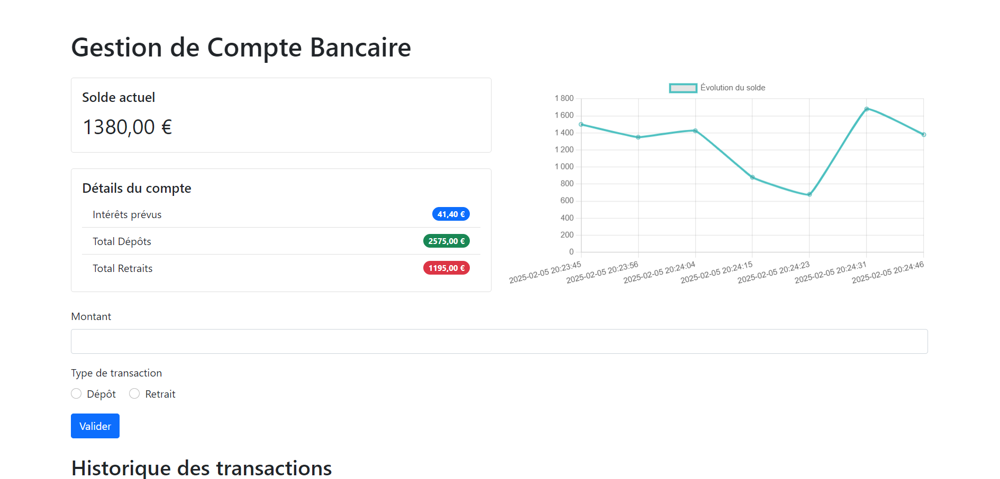

# LIVRET-COBOL
 
Un programme vous permettant de suivre l'évolution des actions réalisées sur votre compte bancaire.



## Comment l'utiliser

Renseignez un montant dans l'input dédié et choisissez le type de transaction qui est réalisé (dépôt ou retrait). Une fois la validation réalisée, la transaction sera visible sur la page et le diagramme.

## Le fonctionnement

La page est créée à l'aide d'un mélange de PHP et de JAVAScript. Lorsqu'une transaction est réalisée, PHP appel un script écrit en COBOL qui va calculer le solde du compte bancaire. 

> Lors d'un prochain ajout, il sera possible de voir une simulation des intérêts gagnés en fin d'année.

## Les technologies utilisées

La page web est réalisée en PHP et JAVAScript.
Le script de calcul du solde est réalisé en COBOL.

> Le logiciel MAMP a été utilisé pour le serveur.\
> Le programme a été réalisé sous Windows sans mainframe ou WSL. J'ai donc utilisé GNUCobol.

## Installation

### En version locale

#### Le PHP

Pour exécuter ce projet en local, vous aurez besoin d'un environnement PHP. Voici quelques options :

- Utiliser le serveur web intégré de PHP :
    - Assurez-vous d'avoir PHP installé sur votre système ;
    - Ouvrez un terminal dans le dossier du projet ;
    - Exécutez la commande : `php -S localhost:8000` ;
    - Accédez à http://localhost:8000 dans votre navigateur.
- Installer un serveur web local comme Apache ou Nginx avec PHP ;
- Utiliser un outil de développement tout-en-un comme XAMPP, WAMP ou MAMP.

Choisissez l'option qui convient le mieux à votre environnement de développement.

Déplacez le fichier PHP dans l'endroit adéquoit pour qu'il puisse être exécuté.

#### Le COBOL

Pour exécuter un programme COBOL en local, vous aurez besoin d'un environnement de développement COBOL. Voici quelques options :

1. Utiliser un compilateur COBOL :
    - Installez un compilateur COBOL comme GnuCOBOL sur votre système ;
    - Ouvrez un terminal dans le dossier du projet ;
    - Compilez votre programme avec la commande : `cobc -x -o LIVRET01.exe LIVRET01.cbl` ;
    - Exécutez le programme compilé : `LIVRET01.exe`.
2. Installer un IDE COBOL comme Micro Focus Visual COBOL ou Eclipse avec le plugin COBOL ;
3. Utiliser un environnement mainframe émulé pour les applications COBOL plus complexes.

Choisissez l'option qui convient le mieux à votre environnement de développement.

> Dans l'exemple donné, LIVRET01 est le nom du script COBOL, remplassez-le par le nom que vous lui donnerez.
> L'exemple est uniquement fonctionnel pour un environnement Windows, veillez à adapter les commandes en fonction de votre environnement de développement.

Si vous souhaitez uniquement utiliser le fichier `.exe` et ne pas installer d'environnement adapté au développement COBOL, vous pouvez le faire sans problème, les scripts PHPs sont adaptés. Le script `LIVRET01.cbl` est disponible pour que vous puissiez le modifier selon vos besoins.

## Customisation

L'exécutable `LIVRET01.exe` doit être présent dans le même dossier que le fichier `transactions.php` comme dans dépôt GitHub.

> Le script d'exécution et des données est pour l'instant dans le même dossier que le fichier PHP car mon environnement MAMP ne me permets pas de le déplacer ailleurs pour le moment.

Pour modifier l'emplacement de l'exécutable, il faut modifier la variable `$SCRIPT_POSITION` dans le fichier `transactions.php` à votre convenance.

Le fichier `FICHIER.LIVRET` contient toutes les transactions du compte et est nécessaire au bon fonctionnement du programme `LIVRET01.exe`. Celui-ci est placé dans le même dossier que l'exécutable `LIVRET01.exe`.

Pour modifier le nom du fichier de transactions, il vous faut modifier la variable `FICHIER-TRANSACTIONS` dans le script COBOL, accessible à la ligne 000016. Pareil pour le nom du fichier de configuration, contenu dans la variable `FICHIER-TRANSACTIONS` à la ligne 000011.

L'intérêt de fin d'année est ici fixée à 3% (0,03). Il est possible de le modifier en changeant la valeur données dans le fichier `FICHIER-CONFIG`.

La logique du calcul est ici extrêmement simplifiée, ne se composant que d'une simple augmentation du solde de 3%. Cette logique est actuellement modifiable dans le PARAGRAPHE `AFFICHER-RESULTATS` de la ligne 000127. Le calcul est pour le moment réalisé à la ligne 000129 dans la PHRASE suivante :
```
000129     COMPUTE WS-INTERETS-ANNUELS = WS-SOLDE * WS-TAUX-INTERETS.
```

## Les ajouts envisagés

### Nouveau calcul des intérêts

Les intérêts sont calculés de manière très simplifiée, il est envisagé de réalisé un calcul plus réaliste des intérêts.

### Permettre le stockage de plus d'informations

Actuellement, seuls le type de transaction ainsi que son montant sont enregistrés. L'idée serait de pouvoir enregistrer d'autres données aux transactions (telles que les dates par exemple) pour pouvoir avoir plus de détails sur les transactions.

### Permettre la modification de certaines informations depuis la page web

Pour modifier certaines données (telles que le pourcentage d'intérêts ou la position du script par exemple), il faut entrer manuellement les données dans les fichiers correspondants. Il serait plus aisé de pouvoir les modifier depuis l'interface web.

## Auteur

Ce projet a été réalisé par Baptiste BOUGY.

## Changelog

**Version 0.4**

- Intégration de l'affichage du solde via les données de sortie du script COBOL (_**Ajouts envisagés - Affichage du solde grâce au code COBOL**_ répondu) ;
- Intégration de l'affichage des données suivantes récupérées via l'exécution du script COBOL :
    - Les intérêts prévus (de manière simplifée) (_**Ajouts envisagés - Affichage des intérêts**_ répondu) ;
    - Le montant total des dépôts ;
    - Le montant total des retraits.
- Création d'un fichier `FICHIER.CONFIG` permettant de renseigner la valeur des intérêts (compris entre 0 et 1) (_**Ajouts envisagés - Permettre l'attribution d'un taux d'intérêt**_ répondu) ;
- Correction du problème `e-0.3.4.1`.

**Version 0.3.4**

- Correction du problème `e-0.3.3.1`.

_Problèmes rencontrés :_ 

- `e-0.3.4.1` Le script COBOL ne s'exécute pas avec l'environnement MAMP.

**Version 0.3.3**

- Ajout d'un fichier de configuration pour configurer le taux d'intérêts pour le script COBOL. (_**Ajouts envisagés - Permettre la modification de variables**_ répondu).

_Problèmes rencontrés :_ 

- `e-0.3.3.1` Le script COBOL n'arrive pas à lire correctement les données sous l'environnement MAMP.

**Version 0.3.2**

- Ajout de variables globales dans le fichier PHP pour permettre la customisation plus aisée sur les noms des fichiers.
- Correction du problème `e-0.1.1`.

**Version 0.3.1**

- L'exécution du script COBOL via PHP génère désormais un fichier `resultats.txt` contenant la sortie du script COBOL.

**Version 0.3**

- Exécution du script COBOL via PHP lors de l'ajout d'une transaction ;
- Remplissage du fichier de transactions `FICHIER.LIVRET` lors de l'ajout d'une transaction via PHP.

**Version 0.2**

- Création de la base de la page web.

**Version 0.1**

- Création de la base du script COBOL associé à son fichier de transactions :
    - Il calcul le solde d'un compte bancaire puis les intérêts (de manière simplifiée) ;
    - Les données sont stockées dans un fichier externe sous un format précis : 
        - Le premier caractère défini le type de transaction ;
        - Les 6 caractères suivants définissent le montant entier de la transaction ;
        - Les 2 derniers caractères définissent les décimales de la transaction.
        - En exemple :
            - `D00010000` pour un dépôt de 100,00€ sur le compte ;
            - `R00010000` pour un retrait de 100,00€ sur le compte.

_Problèmes rencontrés :_ 

- `e-0.1.1` Seule la première transaction est prise en compte.